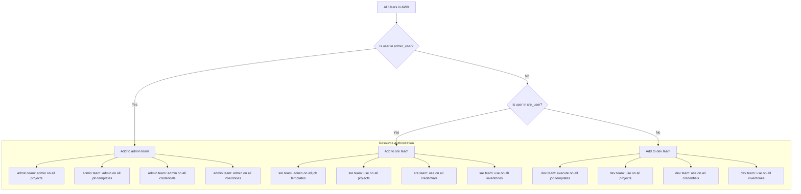

# AWX Tower Role Assignment Logic (Mermaid Diagram)

```mermaid
flowchart TD
    A[All Users in AWX] --> B{Is user in admin_user?}
    B -- Yes --> C[Add to admin team]
    B -- No --> D{Is user in sre_user?}
    D -- Yes --> E[Add to sre team]
    D -- No --> F[Add to dev team]

    subgraph Resource Authorization
      direction TB
      C --> G1[admin team: admin on all projects]
      C --> G2[admin team: admin on all job templates]
      C --> G3[admin team: admin on all credentials]
      C --> G4[admin team: admin on all inventories]

      E --> H1[sre team: admin on all job templates]
      E --> H2[sre team: use on all projects]
      E --> H3[sre team: use on all credentials]
      E --> H4[sre team: use on all inventories]

      F --> I1[dev team: execute on all job templates]
      F --> I2[dev team: use on all projects]
      F --> I3[dev team: use on all credentials]
      F --> I4[dev team: use on all inventories]
    end
``` 